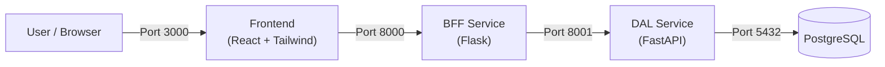

# Simple Task Manager

A lightweight, locally-testable full-stack "Task Manager" project demonstrating the **Kruiz Ecosystem Architecture**.

## Architecture

The project follows a strict 3-tier microservices pattern:



- **Frontend**: Handles UI/UX.
- **BFF (Backend-for-Frontend)**: Orchestrates requests and simplifies authentication/formatting for the client.
- **DAL (Data Access Layer)**: The single source of truth, managing database interactions and business logic.

---

## Getting Started

### Prerequisites
- Docker & Docker Compose installed.

### Run the App
1. **Start the Stack**:
   ```bash
   docker-compose up --build
   ```
   *Wait until you see logs indicating services are running (approx 30-60 secs on first run).*

2. **Open the Dashboard**:
   Go to [http://localhost:3000](http://localhost:3000)

---

## Full Testing Experience (The "Store Mode")

Follow this sequence to experience the full data flow.

### Step 1: The Clean Slate
Initially, your dashboard at `localhost:3000` should be empty.
Verify the backend is empty via your terminal:

```bash
# Ask the BFF for tasks
curl -s http://localhost:8000/api/tasks | json_pp
# Output: []
```

### Step 2: Create a Task (Backend Trigger)
Let's simulate an external system or API creation.

```bash
curl -X POST http://localhost:8000/api/tasks \
  -H "Content-Type: application/json" \
  -d '{"title": "Review deployment logs"}'
```

**Observation**:
- Go to your Browser ([localhost:3000](http://localhost:3000)).
- **Refresh** (or wait for potential auto-fetch if implemented, but refresh to be sure).
- You should see "Review deployment logs" appear!

### Step 3: Complete a Task (Frontend Action)
1. In the Browser, click the **"Check"** button next to the task.
2. The task should turn green and strike-through.

### Step 4: Verify Consistency
Check the backend again to ensure the status persisted to the database.

```bash
curl -s http://localhost:8000/api/tasks | json_pp
```
*Expected Output:*
```json
[
   {
      "id": 1,
      "title": "Review deployment logs",
      "is_completed": true,
      "created_at": "..."
   }
]
```

---

## API Reference

| Service | Port | Endpoint | Method | Description |
|---------|------|----------|--------|-------------|
| **BFF** | 8000 | `/api/tasks` | GET | List all tasks |
| **BFF** | 8000 | `/api/tasks` | POST | Create a new task |
| **BFF** | 8000 | `/api/tasks/:id/complete` | PATCH | Mark task complete |
| **DAL** | 8001 | `/tasks/` | GET | List tasks (Internal) |
| **DAL** | 8001 | `/tasks/:id` | PATCH | Update task (Internal) |

## Troubleshooting

- **Ports already in use?**
  Modify `docker-compose.yml` ports mapping (e.g., `"3001:5173"` for frontend).
- **Database error?**
  Run `docker-compose down -v` to wipe the database volume and start fresh.
